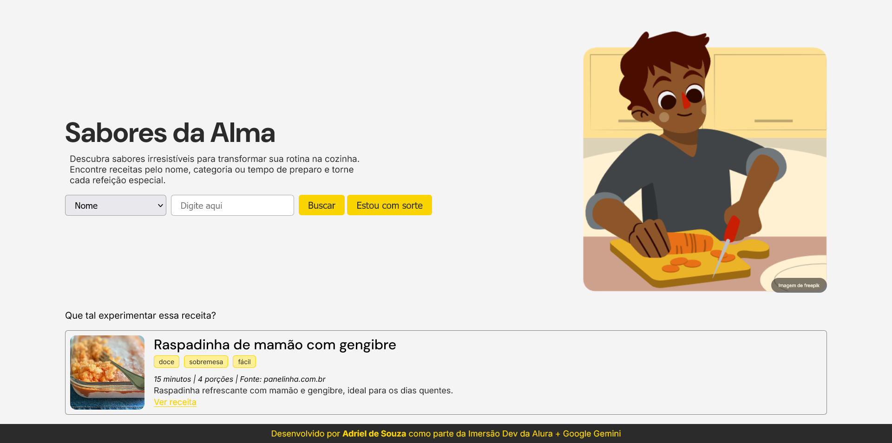

# Sabores da Alma

**Sabores da Alma** é um catálogo de receitas online que oferece uma experiência simples e prática para quem busca descobrir novos sabores e transformar a rotina na cozinha. Este projeto foi desenvolvido durante a Imersão Dev da Alura + Google Gemini.



## Visão Geral

O **Sabores da Alma** é um site que permite aos usuários encontrar receitas de maneira fácil, utilizando filtros como nome, categoria ou tempo de preparo. Além disso, o usuário pode contar com a função "Estou com sorte", que exibe uma receita aleatória.

O projeto está disponível online e pode ser acessado em: [Sabores da Alma](https://dsadriel.github.io/imersao-dev-alura-gemini/).

## Funcionalidades
- **Busca por receitas:** Utilize filtros para encontrar receitas pelo nome,categoria ou tempo de preparo.
- **Estou com sorte:** Clique no botão "Estou com sorte" para receber uma sugestão de receita aleatória.
- **Interface intuitiva:** Simples e prática para facilitar a navegação.
- **Responsivo:** Otimizado para dispositivos móveis e desktop.

## Tecnologias Utilizadas
- **HTML5:** Estrutura básica do site.
- **CSS3:** Estilização e layout.
- **JavaScript:** Interatividade com os usuários e lógica da busca.
- **Google Gemini:** Usado para facilitar a criação do site.
    - Também foi utilizado **AI Studio** para a geração das informações das receitas, com base no nome da receita.

## Instalação
Para rodar o projeto localmente, siga os passos abaixo:
Clone este repositório:
```bash
git clone https://github.com/dsadriel/imersao-dev-alura-gemini.git
```

Navegue até a pasta do projeto:
```bash
cd imersao-dev-alura-gemini
```
Abra o arquivo `index.html` em um navegador para visualizar o site localmente.

## Como Usar
No topo da página, você encontrará um campo de busca onde poderá digitar o nome da receita ou usar os filtros disponíveis.

Após inserir os critérios de busca, clique em Buscar para visualizar as receitas.

Se estiver em dúvida sobre o que preparar, experimente o botão Estou com sorte para obter uma sugestão aleatória.

## Créditos
As imagens utilizadas no banner do site foram obtidas através do site [freepik.com](https://www.freepik.com/).

As imagens das receitas foram retiradas dos sites mencionados nas receitas.